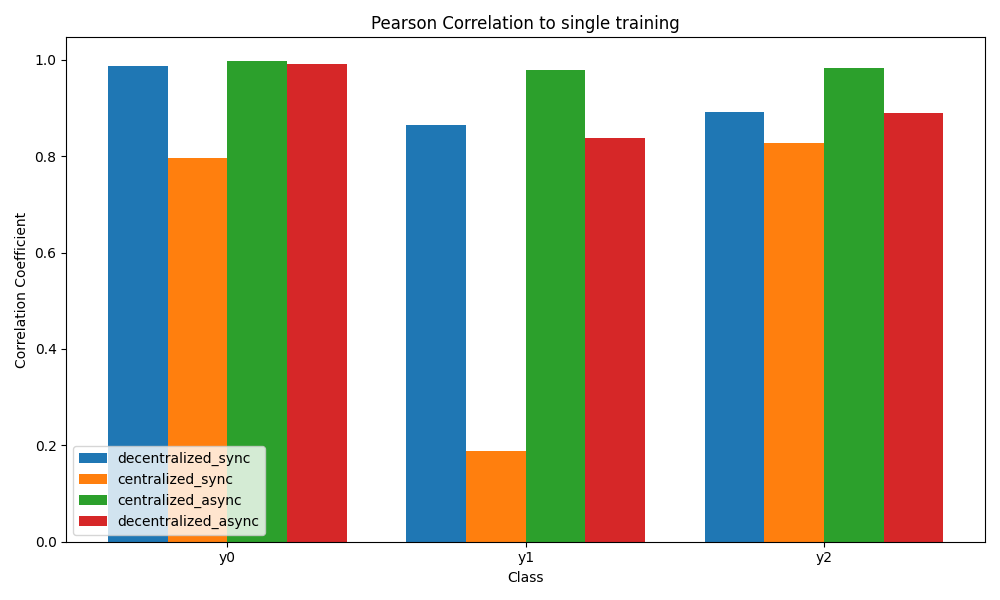
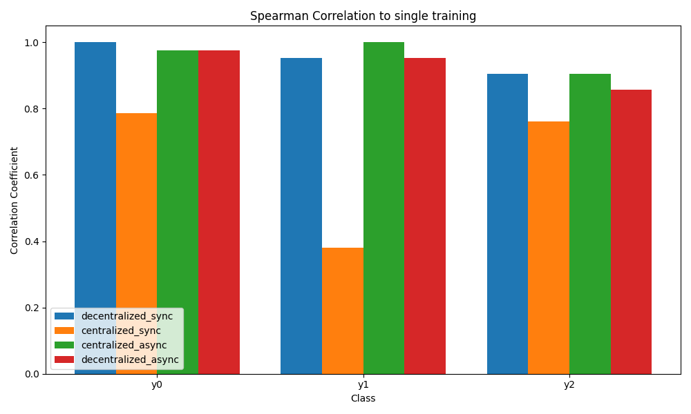
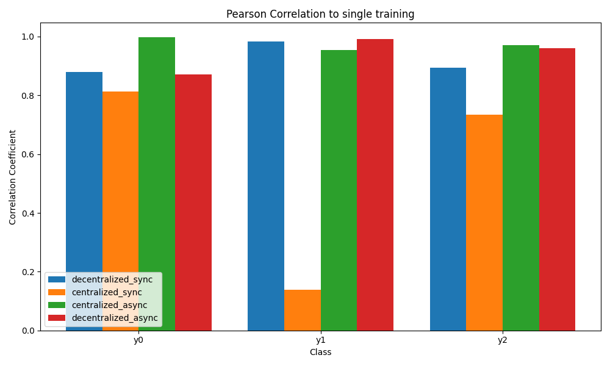
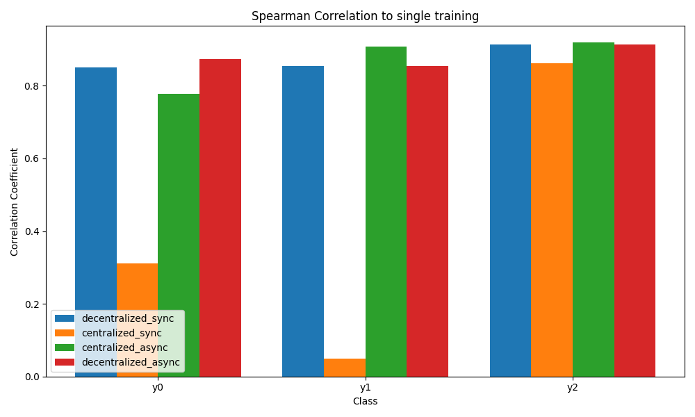
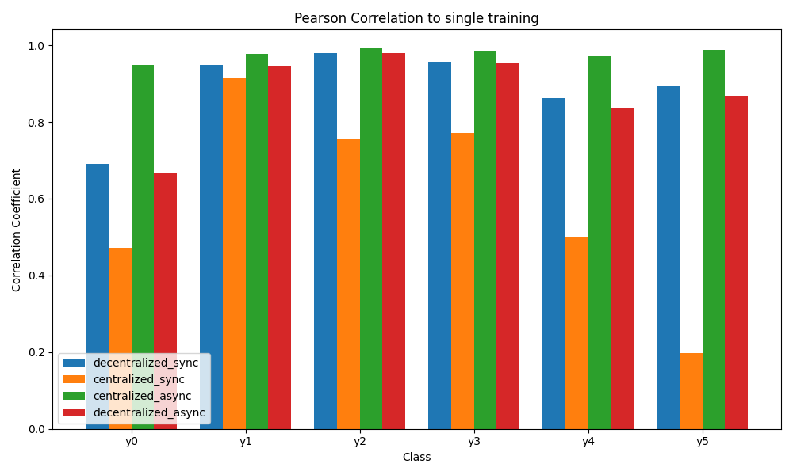
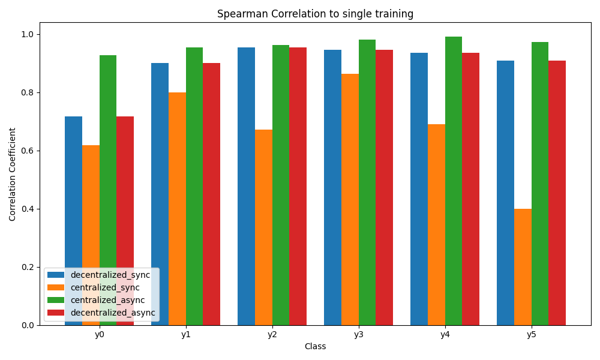
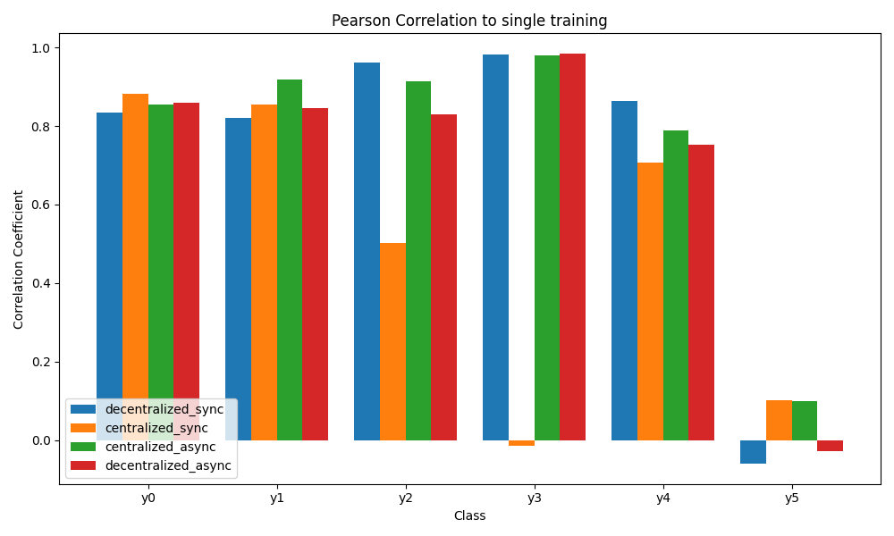
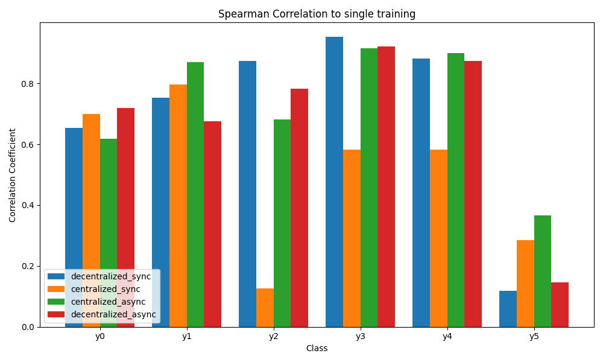

# XAI-FL

## Structure

This repository has the following structure:
```
├── FL/
├── XAI/
├── correlation.py
├── data_division.py
├── feature_analysis.py
├── federated_learning.py
├── model_eval.py
├── single_training.py
└── xai.py
```

Other folders contain data and results for specific datasets, which have the following structure:
```
├── data/
├── fl/
├── models/
├── xai/
└── [DATASET].py
```

For the main structure:
- FL/ contains the implementation of the federated learning algorithms, which are used in federated_learning.py. 
- XAI/ contains the implementation of the XAI algorithms, which are used in xai.py. 
- The other files are used to run experiments, use --help to see the options.

For the dataset structure:
- data/ contains the data files, including the train, test, validation and specific workers' data.
- fl/ contains the results of the federated learning algorithms, including the models and the training logs, for each experiment.
- models/ contains the models to be used in XAI algorithms.
- xai/ contains the results for each XAI algorithm, including the .csv files with the explanations and the plots.
- data_processing.py is used to create data for training, validation and testing from the raw data.
- model.py has the implementation of the model to be used in the experiments.

## Running the experiments


## Results

### Network Slicing

#### SHAP

##### PCC



##### SRCC




#### fANOVA 

##### PCC



##### SRCC




### Intrusion Detection

#### SHAP

##### PCC



##### SRCC




#### fANOVA 

##### PCC



##### SRCC




## Authors

* **Rafael Teixeira** - [rgtzths](https://github.com/rgtzths)
* **Leonardo Almeida** - [leoalmPT](https://github.com/leoalmPT/)
* **Pedro Rodrigues** - [pedro535](https://github.com/pedro535/)

## License

This project is licensed under the MIT License - see the [LICENSE](LICENSE) file for details